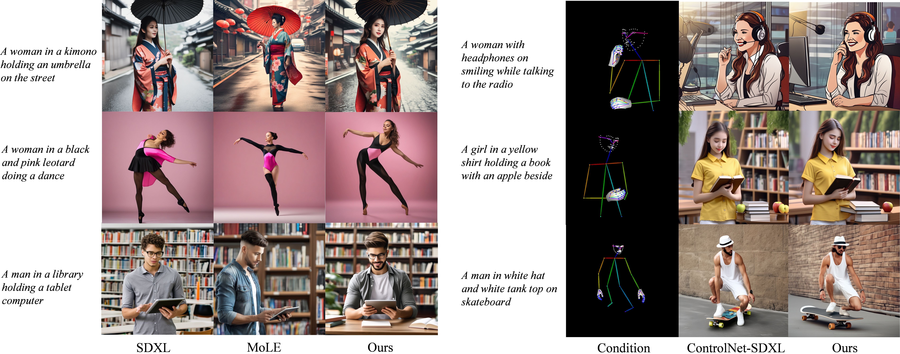
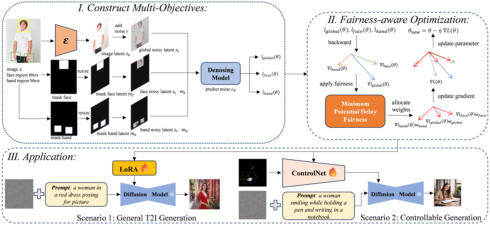

# FairHuman

Official implementation of **[FairHuman: Boosting Hand and Face Quality in Human Image Generation with Minimum Potential Delay Fairness in Diffusion Models](https://arxiv.org/abs/2507.02714)**

[](https://arxiv.org/abs/2507.02714)<br>
<h3 align="center">
    
</h3>

><p align="center"> <span style="color:#137cf3; font-family: Gill Sans">Yuxuan Wang,</span><sup>1</sup></a>  <span style="color:#137cf3; font-family: Gill Sans">Tianwei Cao</span><sup>1*</sup>,</a> <span style="color:#137cf3; font-family: Gill Sans">Huayu Zhang,</span><sup>2</sup></a>  <span style="color:#137cf3; font-family: Gill Sans">Zhongjiang He,</span><sup>2</sup> </a>  <span style="color:#137cf3; font-family: Gill Sans">Kongming Liang</span><sup>1*</sup>,</a> <span style="color:#137cf3; font-family: Gill Sans">Zhanyu Ma</span><sup>1</sup></a> <br> 
><span style="font-size: 16px">Beijing University of Posts and Telecommunications,</span><sup>1</sup></a>  <span style="font-size: 16px">Institute of Artificial Intelligence China Telecom(TeleAI)</span><sup>2</sup></a>  </p>

<p align="center">

</p>

## 🔥 News
- [07/04/2025] 🔥 The arXiv [paper](https://arxiv.org/abs/2507.02714) of FairHuman is released.
- [07/03/2025] 🔥 The [training code](https://github.com/PRIS-CV/FairHuman) and [inference code](https://github.com/PRIS-CV/FairHuman) are released.


## 📖 Introduction
Although large-scale text-to-image models (e.g., diffusion models) have made significant progress, the generation of local details such as faces and hands still suffers from deficiencies due to insufficient training supervision. To address this, we propose a multi-objective fine-tuning framework called FairHuman: 1) constructing a triple optimization objective comprising global (default diffusion objective) and local (based on face/hand spatial priors) targets; 2) employing the Minimum Potential Delay(MPD) criterion to derive a fairness-aware parameter update strategy. This approach significantly improves local detail generation while maintaining overall quality and can be applied in diverse scenarios.


## ⚡️ Quick Start

### 🔧 Requirements and Installation

Install the requirements
```bash
# create a virtual environment with python >= 3.10 <= 3.12, like
conda create -n fairhuman python=3.10 -y
conda activate fairhuman
# then install the requirements by you need
pip install -r requirements.txt # legacy installation command
# or
conda env create -f environment.yml
# Install the rest of the dependencies
cd preprocessor/hamer
pip install -e .[all]
pip install -v -e third-party/ViTPose
```
Before get started, put your models as follow:
```
--models
   --base_model # sd base model if use local checkpoints
   --finetuned_model # finetuned models (eg., lora, controlnet, adapter)
   --hamer # models for extracting control conditions
     --data #put mano model
     --hamer_ckpts #put hamer.ckpt
     --vitpose_ckpts #put wholebody.pth
   --vae # vae model if use local checkpoints
   --yolo # detectors
```
Notes: About the installation of hamer, please refer to https://github.com/geopavlakos/hamer

### ✍️ Inference
Start from the examples below. ✨
```bash
python inference/sdxl_inference.py --eval_txt_path "" --lora_path "" --lora_weight 0.3
python inference/sdxl_controlnet_inference.py --eval_txt_path "" --condition_path "" --controlnet_path ""
python inference/sdxl_adapter_inference.py --eval_txt_path "" --condition_path "" --adapter_path ""
```
Optional prepreration: we also provide a pipeline for automatical post-refining based on controlnet.
```bash
python inference/sdxl_controlnet_refine.py --eval_txt_path "" --controlnet_path "" --target_imgs_path ""
```


### 🚄 Training
Lora finetuning
```bash
bash script/train_lora_sdxl_mpd_fair.sh
```
Controlnet finetuning
```bash
bash script/train_controlnet_sdxl_mpd_fair.sh
```
T2i_adapter finetuning
```bash
bash script/train_t2iadapter_sdxl_mpd_fair.sh
```

### 📌 Tips and Notes
## About dataset preparation
Our custom dataset format can be referred in
```bash
dataset/wholebody_dataset.py
```
and we provide examples of our data curation framework in 
```bash
preprocessor/mask_annoation.py
preprocessor/preprocess.py
```
You can improve upon this framework to build a customized dataset for your own specific task and obtain more accurate annotations through advanced models.
## About backbone models
Due to resource constraints, our code is primarily built upon the [SDXL](https://huggingface.co/stabilityai/stable-diffusion-xl-base-1.0). Given the transferability of our method, we recommend deploying it on more latest models, such as [Flux](https://huggingface.co/black-forest-labs/FLUX.1-dev), to achieve higher image quality.
##  Citation
If FairHuman is helpful, please help to ⭐ the repo.
## Acknowlegements
- Our codebase builds heavily on [diffusers](https://github.com/huggingface/diffusers) 
